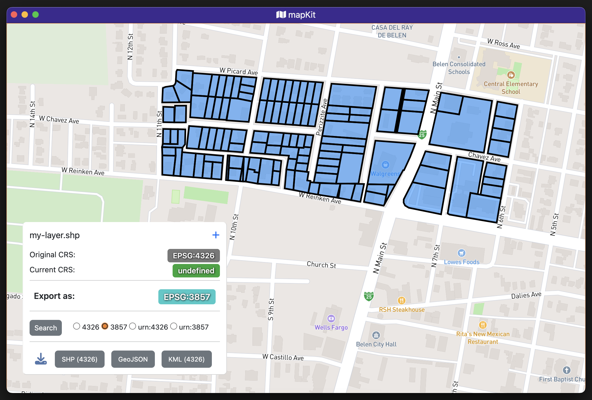

# MapKit

## Drag&Drop Spatial Vector Viewing/Conversion
---

Currently in development. 

Designed to be a quick and easy GUI for common GIS operations.

Current features:
- Drag&Drop any accepted files to map
- Export layer as accepted file type
- Accepted file types:
  - .shp
  - .kml
  - .geojson

Planned features:
- Display GeoJSON file for viewing/live editing
- Modify/export GeoJSON/Shapfiles/SNAPPLAN/KML/txt files
- Add GeoTiff
- MBtiles?
---

